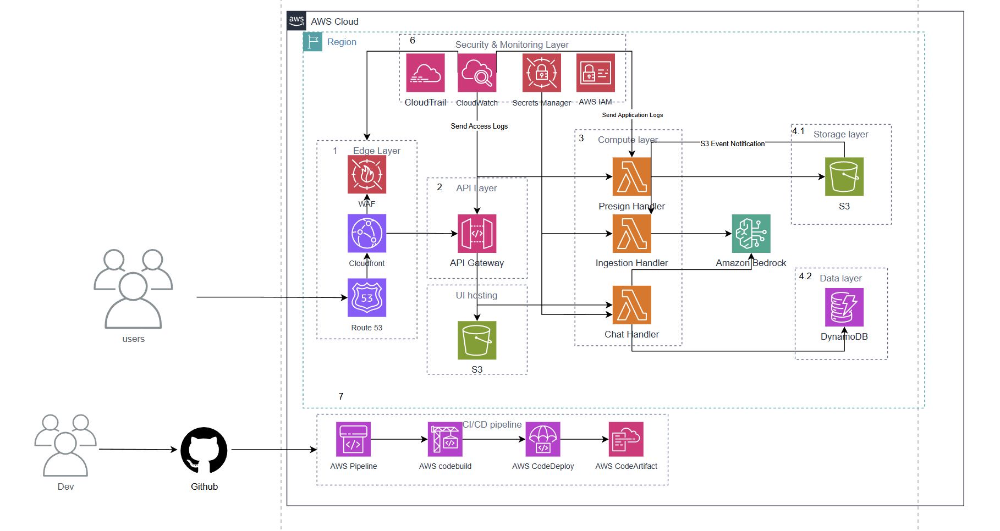

# Project Proposal (Optimizing RAG-based Chatbot Systems on AWS with LangChain)

## About us

| No. | Full Name | Student ID | Role | Responsibilities |
| :-: | :--------------------- | :--------- | :---------------------------------- | :---------------------------------------------------------------------------------------------------------------- |
| 1 | **Nguyễn Lê Anh Quân** | SExxxxx | **Team Leader / Cloud Architect** | Designs overall AWS architecture, manages the project, and integrates AWS services (Lambda, API Gateway, Bedrock, S3). |
| 2 | **Trần Minh Tuấn** | SExxxxx | **Backend Developer** | Develops Lambda functions, implements API Gateway, and integrates Bedrock Knowledge Bases. |
| 3 | **Phạm Ngọc Anh** | SExxxxx | **Frontend Developer** | Designs and develops the React interface, integrates Cognito and API Gateway, and optimizes user experience. |
| 4 | **Lê Hoàng Mai** | SExxxxx | **QA Engineer** | Writes unit, integration, and E2E test cases; ensures software quality and monitors the CI/CD pipeline. |
| 5 | **Ngô Đức Huy** | SExxxxx | **DevOps Engineer / Data Engineer** | Builds the CI/CD pipeline, monitors the system (CloudWatch), optimizes performance, and manages data in OpenSearch. |

---

## Executive Summary

This proposal outlines the **Chatbot Project**, an intelligent **Question-Answering (QA) platform** built on **Amazon Web Services (AWS)**.  
The project addresses a common challenge faced by students, researchers, and professionals: **wasting valuable time and reducing productivity while searching for specific information** across massive academic document collections such as textbooks, research papers, and reports.

### **Core Problem**
Currently, information retrieval primarily depends on **manual keyword searches**, which are often imprecise and inefficient.  
On average, a student may spend **5–10 hours per week** filtering and searching through documents — significantly impacting learning and research outcomes.

### **Proposed Solution**
EduQuery is a **serverless web application with an integrated chatbot** that allows users to upload documents (PDF, DOCX, TXT) and ask questions in natural language.  
The system generates precise, context-aware answers drawn directly from document content.  
It leverages the **Retrieval-Augmented Generation (RAG)** architecture and AWS services such as **Amazon S3**, **AWS Lambda**, and **Amazon Bedrock** to provide a **secure, scalable, and cost-efficient** solution.

---

## 1. Problem Statement

In higher education and research environments, students, lecturers, and researchers handle a large volume of academic materials daily — including textbooks, research articles, conference papers, theses, and lecture notes.  
The current process of extracting relevant information from these sources is **manual** and **time-consuming**:

1. **Manual scanning:** Users must read through dozens or even hundreds of pages to identify relevant content.  
2. **Keyword-based search (Ctrl+F):** Limited by vocabulary — fails if the search term doesn’t exactly match the document wording.  
   *Example:* Searching “effects of climate change” may miss passages discussing “consequences of global warming.”  
3. **Fragmented document management:** Information is scattered across multiple files and formats, complicating synthesis and retrieval.

---

### **Key Challenges**

- **Severe time inefficiency:**  
  According to university surveys, students spend **5–10 hours weekly** searching for and filtering documents — time that could be used for learning, analysis, and research.

- **Reduced research quality:**  
  Under time pressure, users may overlook crucial information or conceptual relationships, lowering the quality of essays, theses, and research papers.  
  Manual searches can result in **up to 30% of relevant information being missed**.

- **Poor user experience and frustration:**  
  Repetitive manual searching causes fatigue and demotivation.  
  About **75% of students** report feeling “overwhelmed” and “discouraged” when managing academic documents.

---

### **User Impact**

- **Students:**  
  Most affected, as they face tight deadlines and exam pressure. Inefficient searches increase stress and reduce productivity.

- **Lecturers and Researchers:**  
  Lose valuable time locating teaching materials and references for scientific publications, impacting their productivity and research quality.

- **Libraries and Educational Institutions:**  
  The reputation of an institution depends on teaching and research quality.  
  Offering AI-powered tools enhances competitiveness and helps attract talent.

---

### **Business Impact**

If educational institutions fail to act, they risk:
- **Reduced academic productivity:** Continued waste of time and resources.  
- **Technological lag:** Competitors adopting AI tools gain a learning experience advantage.  
- **Lower student satisfaction:** Poor user experience can harm institutional reputation and enrollment rates.  
- **Operational inefficiency:** Maintaining manual processes increases administrative burden.

---

### **Project Goals**

Chatbot directly addresses these issues by offering an **intelligent, efficient, and user-friendly** solution.

**Objectives:**
- **Increase learning efficiency:** Reduce information search time by **40–60%**, allowing students to focus on deeper analysis.  
- **Enhance research quality:** Deliver accurate, contextual answers to improve essays and research outputs.  
- **Provide institutional advantage:** Position educational organizations as leaders in **AI-driven learning** and **Generative AI** adoption.

This chatbot is not just a technological solution — it’s a **strategic investment** in improving education quality and research performance.

---

## 2. Solution Architecture

The Chatbot solution follows a **serverless microservices architecture** on **AWS**, ensuring **scalability**, **high reliability**, **multi-layered security**, and **cost optimization**.

The system workflow consists of two main processes:
- **Document Ingestion:** Handling document uploads, parsing, and embedding.  
- **Information Querying:** Retrieving and generating accurate answers in real-time.

This architecture enables:
- **Elastic scalability** to handle variable workloads.  
- **High reliability** with fault-tolerant design.  
- **Multi-layered security** protecting data at every level.  
- **Optimized operational costs** using pay-per-use AWS services.

Kiến trúc gồm 5 tầng chính:
1️⃣ **Edge Layer**  
2️⃣ **API Layer**  
3️⃣ **Compute Layer**  
4️⃣ **Storage & Data Layer**  
5️⃣ **Security & Monitoring Layer**  
6️⃣ **CI/CD Pipeline**

---

## 🧩 1. Edge Layer

### Components:
- **Amazon Route 53:** Manages DNS and maps the application’s domain (e.g., `eduquery.cloud`).  
- **Amazon CloudFront:** Delivers static web content (UI) globally with low latency and high speed.  
- **AWS WAF (Web Application Firewall):** Protects the system against DDoS, SQL injection, XSS, and other common web attacks.

### Workflow:
Users access the application via the domain managed by **Route 53**.  
**CloudFront** serves the **React UI** hosted on **Amazon S3**.  
Requests such as *upload*, *ask*, or *chat* are routed to **API Gateway**.

---

## ⚙️ 2. Compute Layer

### Components:
- **Amazon API Gateway:** Provides RESTful APIs as the single entry point for the frontend and other integrations.  
- **Presign Handler:** Generates pre-signed URLs to allow secure file uploads directly to **Amazon S3**.  
- **Ingestion Handler:** Triggered when a new file is uploaded to S3 (`S3:ObjectCreated` event). Reads the file, performs **chunking**, and sends data to **Amazon Bedrock Knowledge Base** for **embedding** and vector storage.  
- **Chat Handler:** Receives user queries, retrieves related text chunks from **Bedrock Knowledge Base**, then calls the **Foundation Model (Anthropic Claude 3 Sonnet)** to generate a contextual answer.  
  The final result is saved in **DynamoDB** (conversation history storage).

**Amazon Bedrock** serves as the **AI core** of the system, providing:
- **Embedding** via *Amazon Titan Embedding Model*.  
- **Text generation** via *Claude 3 Sonnet Foundation Model*.
---

## 🗄️ 3. Storage & Data Layer

### Components:
- **Amazon S3:**
  - Stores uploaded user documents (PDF, DOCX, TXT).  
  - Hosts the React UI (integrated with CloudFront).  
  - Triggers the **Lambda ingestion handler** through **S3 Event Notifications**.

- **Amazon DynamoDB:**
  - Stores metadata, query logs, and user conversation histories.

- **Amazon Bedrock Knowledge Bases:**
  - Stores **vector embeddings** of document text chunks.  
  - Optimized for **k-NN retrieval** in the **RAG pipeline**.
---

## 🔐 4. Security & Monitoring Layer

### Components:
- **AWS IAM:** Manages access control based on the **least privilege principle**.  
- **AWS Secrets Manager:** Stores and encrypts sensitive data (API keys, database credentials).  
- **Amazon CloudWatch:** Monitors logs, metrics, and sends automated alerts.  
- **AWS CloudTrail:** Records all API activities for auditing purposes.

### Data Security:
- **Encryption at Rest:** Enabled for S3, DynamoDB, and Bedrock (AES-256).  
- **Encryption in Transit:** All connections use HTTPS/TLS 1.2.  
- **Authentication:** Implemented via **Amazon Cognito** using **JWT tokens** for secure API Gateway access.
---

## 🧪 5. CI/CD Pipeline

### Components:
- **GitHub:** Central code repository.  
- **AWS CodePipeline:** Manages the full build and deployment workflow.  
- **AWS CodeBuild:** Builds the project and runs automated unit tests.  
- **AWS CodeDeploy:** Deploys Lambda functions, frontend assets, and IaC templates.  
- **AWS CodeArtifact:** Stores dependency packages.

### DevOps Workflow:
1. Developer commits code → **GitHub**.  
2. **CodePipeline** automatically triggers a build via **CodeBuild**.  
3. After successful testing, **CodeDeploy** deploys the updates to **Dev/Staging/Prod** environments.  
4. Logs and deployment statuses are visible in **CloudWatch** and optionally integrated with **Slack** via webhook.

## 🌐 End-to-End Workflow Overview

This section describes the **complete data flow** of the EduQuery Chatbot system — from user interaction to backend processing and AI-powered answer generation — built entirely on **AWS serverless architecture**.

---

### ⚙️ **1. Main Workflow**

#### **1️⃣ Frontend (React + S3 + CloudFront)**
- The user interacts through a **React single-page application (SPA)**.  
- The frontend is **hosted on Amazon S3** and **distributed globally** via **CloudFront** for low-latency access.  
- Users can upload documents and send questions directly through the web interface.

#### **2️⃣ File Upload Flow (Asynchronous)**
1. The web app sends a request to **API Gateway** (`/upload` endpoint).  
2. **API Gateway** triggers a **Lambda function** that generates a **pre-signed S3 URL**.  
3. The client uploads the document directly to **Amazon S3** using that secure URL.  
4. The **S3:ObjectCreated** event triggers another **Ingestion Lambda**, which:  
   - Reads the document content  
   - Splits it into chunks  
   - Sends the data to **Amazon Bedrock Knowledge Base** for **embedding** and **vector storage**.  

#### **3️⃣ Question & Answer Flow (Synchronous)**
1. The user submits a question via the frontend (`/ask` endpoint).  
2. The request goes through **API Gateway** → **Chat Lambda**.  
3. The **Chat Lambda**:  
   - Retrieves relevant text chunks from **Bedrock Knowledge Base**.  
   - Builds a complete prompt combining the question and retrieved content.  
   - Calls a **Foundation Model** (e.g., Claude 3 Sonnet) to generate an answer.  
   - Saves the query and answer history in **Amazon DynamoDB**.  
4. The result is sent back to the frontend and displayed instantly.

---

### 🧠 **2. Core AWS Components**

| **Category** | **AWS Service** | **Purpose** |
|---------------|----------------|--------------|
| **Frontend Hosting** | S3 + CloudFront | Host and deliver the React UI globally |
| **API Gateway** | Amazon API Gateway | Route client requests to backend Lambdas |
| **Backend Logic** | AWS Lambda | Handle uploads, ingestion, and question answering |
| **AI Core** | Amazon Bedrock | Manage embeddings, vector retrieval, and text generation |
| **Data Storage** | S3, DynamoDB | Store documents, chat history, and metadata |
| **Security** | IAM, WAF, HTTPS | Control permissions and protect from attacks |
| **Monitoring** | CloudWatch, CloudTrail | Log tracking, metrics, and auditing |
| **CI/CD** | CodePipeline, CodeBuild, CodeDeploy | Automate build, testing, and deployment |

---

### 🔧 **3. Technical Overview**

- **Compute:** AWS Lambda (Node.js or Python runtime)  
- **Storage:** Amazon S3, DynamoDB, and OpenSearch (via Bedrock)  
- **AI/ML:** Amazon Bedrock (Claude 3 Sonnet, Titan Embedding Models)  
- **Networking:** CloudFront for content delivery and API Gateway for routing  

---

### 🧪 **4. Development & Deployment**

- **Infrastructure as Code (IaC):** Managed using **AWS CDK** or **CloudFormation**.  
- **CI/CD Pipeline:**  
  1. Developer commits code → GitHub  
  2. **CodePipeline** triggers **CodeBuild** for building and testing  
  3. **CodeDeploy** deploys to **Dev**, **Staging**, and **Production** environments  
- **Rollback:** Automatically handled via CodeDeploy and IaC templates.

## 4. Timeline & Milestones
Project Timeline
### **Phase 1: Foundation & Backend Core (Weeks 1–4)**

**Deliverables:**
- Set up AWS environment (VPC, IAM Roles).  
- Build infrastructure as code (IaC) using **AWS CDK** or **CloudFormation**.  
- Develop ingestion flow: **Lambda function** for file processing and integration with **Amazon Bedrock Knowledge Bases**.  
- Develop query flow: **Lambda function** for question processing, retrieval, and answer generation.  

**Success Criteria:**  
- Able to upload documents to **Amazon S3** and trigger automatic processing.  
- Internal API calls can retrieve and return answers from uploaded documents.  

**Milestone 1 (Completed by Week 5): Backend MVP Completed**  
- Criteria: Document ingestion and query flows operate successfully through automated testing.
---

### **Phase 2: API & Security (Weeks 5–7)**

**Deliverables:**
- Build API endpoints on **Amazon API Gateway** (/upload, /ask, /history).  
- Integrate **Amazon Cognito** for user registration, login, and JWT-based authentication.  
- Secure all API endpoints using **Cognito Authorizer**.  

**Success Criteria:**  
- Users can register/login and make authenticated API calls via tools such as **Postman**.  

**Milestone 2 (Completed by Week 8): Secure API Completed**  
- Criteria: All endpoints are protected and accessible via Cognito authentication tokens.
---

### **Phase 3: Frontend Development (Weeks 8–11)**

**Deliverables:**
- Design **UI/UX** for the application.  
- Develop the frontend using **React**, including:  
  - Login page  
  - File upload interface  
  - Chat/Q&A interface  
- Integrate the frontend with backend APIs.  

**Success Criteria:**  
- A fully functional and user-friendly interface that allows end-users to interact with the system.  

**Milestone 3 (Completed by Week 12): Alpha Version Completed**  
- Criteria: End-to-end version is operational — users can log in, upload documents, and query data.
---

### **Phase 4: Testing, Deployment & Launch (Weeks 12–14)**

**Deliverables:**
- Conduct comprehensive testing (**unit**, **integration**, **performance**).  
- Build **CI/CD pipeline** using **AWS CodePipeline** for automated deployment.  
- Deploy a **beta version** for user testing.  
- Collect feedback and refine the product before release.  

**Success Criteria:**  
- Stable deployment with functional CI/CD pipeline, ready for production use.  

**Milestone 4 (Completed by Week 14): Ready for Launch**  
- Criteria: System successfully tested, deployed to production through CI/CD pipeline, and ready for end users.

The project has been fully tested, deployed in the **production environment** through a **CI/CD pipeline**, and is **ready for end users**.

## 👥 Resource Allocation
- **Cloud Architect / Team Lead:** Responsible for system architecture design and overall project management.  
- **Backend Team (2 Developers):** Develops **Lambda functions**, **Infrastructure as Code (IaC)**, and core business logic.  
- **Frontend Developer (1):** Responsible for building the **user interface** and integrating frontend with APIs.  
- **QA Engineer (1):** Designs and executes **testing scenarios**, ensuring system reliability and quality.

5. Budget Estimation

The budget is divided into **one-time development** costs and monthly operational costs, based on the assumption of 1,000 active users and the application of cost optimization strategies.

| **AWS Service** | **Assumptions** | **Estimated Cost (USD/month)** | **Notes** |
|------------------|------------------|---------------------------------|------------|
| **AWS Lambda** | 200,000 uploads/month (30s each); 2,000,000 queries/month (5s each) | **~$120** | Optimized (e.g., Graviton, memory size) |
| **Amazon API Gateway** | ~2.2M requests/month | **~$8** | API management cost |
| **Amazon S3** | 200 GB storage | **~$5** | Document and frontend hosting |
| **Amazon Bedrock** | Ingestion: 200,000 docs (~4M tokens/month)   Querying: 2M queries (~30M tokens with Claude 3 Sonnet) | **~$440** | Reduced by ~35% via caching frequent queries |
| **Amazon Cognito** | 1,000 monthly active users (MAUs) | **~$0** | Covered under free tier |
| **CloudWatch & Data Transfer** | Logging and monitoring | **~$20** | Optimized logging setup |
| **Total Monthly Infrastructure Cost** |  | **≈ $593/month** |  |

### Development Costs (One-time)

- Assumes a **4-member team** working for **3.5 months (14 weeks)**.  
- **Average salary (assumption):** $2,500 per person per month.  
- **Total cost:** 4 × $2,500 × 3.5 = **$35,000**  
- *(Note: This is an estimated value and can be adjusted based on actual personnel costs.)*

### Operational Costs (Ongoing)

| **Category** | **Description** | **Estimated Cost (USD/month)** |
|---------------|------------------|--------------------------------|
| **AWS Infrastructure** | Monthly infrastructure cost | **~$593** |
| **Maintenance & Monitoring** | Estimated 5% of one engineer’s time | **~$125** |
| **Total Monthly Operational Cost** |  | **≈ $718/month** |

### 📈 ROI Analysis
---

#### **Value Generation**

- **Number of users:** 1,000 students  
- **Average time saved per user:** 3 hours/week  
- **Total time saved:** 1,000 × 3 hours × 4 weeks = **12,000 hours/month**  
- **Assumed value per hour (opportunity cost):** **$1.25/hour**  
- **Total value generated:** 12,000 × $1.25 = **$15,000/month**
---

#### **Return on Investment (ROI)**

- **Monthly profit:** $15,000 (Value) − $1,100 (Cost) = **$13,900/month**  
- **Payback period (for development cost):** $35,000 / $13,900 ≈ **2.5 months**
---

#### **Conclusion**

The analysis indicates that the project is **highly profitable** and delivers **significant value**, achieving payback within approximately **2.5 months**.

## 6. Risk Assessment

| No. | Risk Type                                                | Impact Level | Probability | Priority |
| :-: | :------------------------------------------------------- | :----------- | :---------- | :------- |
|  1  | **Technical:** Inaccurate AI responses *(Hallucination)* | High         | Medium      | High     |
|  2  | **Technical:** Slow vector query performance             | Medium       | Low         | Medium   |
|  3  | **Security:** Leakage of sensitive data from documents   | Very High    | Low         | High     |
|  4  | **Business:** Users may reject the product               | High         | Medium      | High     |
|  5  | **Operational:** AWS costs exceed budget                 | High         | Medium      | Medium   |
|  6  | **Project:** Delays due to complex technical issues      | Medium       | Medium      | Medium   |

##  Mitigation Strategies & Contingency Plans

### **Inaccurate AI Responses (Hallucination)**

**Mitigation:**

1. Apply **Prompt Engineering** to ensure the model responds strictly based on the provided context.
2. Display **source chunks** along with the generated answer for user verification.
3. Use the latest and most suitable **Foundation Models** available on **Amazon Bedrock**.

---

### **Slow Vector Query Performance**

**Mitigation:**

1. Use **Amazon OpenSearch Serverless**, optimized by AWS for k-NN search.
2. Optimize **chunk size** and **metadata** for more efficient filtering.

---

### **Sensitive Data Leakage**

**Mitigation:**

1. Encrypt data both **at rest** and **in transit**.
2. Enforce the **least-privilege principle** for IAM roles.
3. Implement **multi-tenancy isolation** to ensure users cannot access others’ data.

---

### **Low User Adoption**

**Mitigation:**

1. Develop the product in iterative phases and collect early feedback from beta users.
2. Focus on creating a **simple and intuitive UI/UX**.
3. Conduct training sessions and marketing to communicate product benefits.

---

### **AWS Cost Overruns**

**Mitigation:**

1. Set up **AWS Budgets** and automated cost alerts.
2. Regularly monitor expenses using **AWS Cost Explorer**.
3. Choose **Foundation Models** with the best cost-to-performance ratio for each task.

---

### **Project Delays**

**Mitigation:**

1. Apply the **Agile methodology** to adapt plans dynamically.
2. Identify and address technical risks early during the **PoC (Proof of Concept)** stage.
3. Allocate **buffer time** in the project timeline.

---

##  Contingency Plans

* **If AI Hallucination Becomes Severe:**
  → Switch to another **Foundation Model** on Bedrock or temporarily show retrieved text snippets instead of synthesized answers.

* **If Bedrock Costs Become Too High:**
  → Limit the number of free queries per month for users and offer paid subscription plans.

## 7. Expected Outcomes
## 📈 Success Metrics

### **Key Performance Indicators (KPIs)**

The following metrics will be tracked to evaluate the project’s effectiveness:

#### **Technical Metrics**

* **API Response Time (p95):** Under 3 seconds per query.
* **System Error Rate:** Below 0.1%.
* **Retrieval Accuracy (RAG):** Achieve 90% accuracy (top 3 chunks contain the correct answer).

#### **Business Metrics**

* **User Adoption Rate:** Reach 500 monthly active users (MAU) within the first 3 months.
* **User Retention Rate:** 60% of users return weekly.
* **Customer Satisfaction (Net Promoter Score - NPS):** Achieve +40 or higher.

#### **Impact Metrics**

* **Average Search Time Reduction:** Decrease from 8 minutes to under 1 minute per information query.

---

## 💼 Business Benefits

### **Short-term (0–6 months)**

* Provide a powerful tool that helps students and researchers save hours each week.
* Enhance engagement with academic materials.

### **Medium-term (6–18 months)**

* Significantly improve the quality of essays, reports, and research papers.
* Build a knowledge ecosystem that can be analyzed to identify learning trends.

### **Long-term (18+ months)**

* Strengthen the institution’s reputation as a pioneer in AI-driven education.
* Expand the platform to support other departments (administrative, legal) or commercialize it.

---

## ⚙️ Technical Improvements

* Transition from an experimental Colab prototype to a production-grade enterprise system.
* Develop a **serverless architecture** that is scalable, secure, and cost-efficient.
* Accumulate expertise in building **Generative AI applications** on AWS.

---

## 🌍 Long-term Value

The **Chatbot Project** generates long-term value by creating a flexible platform that can easily expand with new features, such as:

* **Multimodal Support:** Analyze images and diagrams in documents.
* **LMS Integration:** Seamless connection with learning systems like Moodle or Canvas.
* **Advanced Analytics:** Use AI to recommend related materials or identify learners’ knowledge gaps.

---

## 📚 Appendices

### **A. Technical Specifications**

* **Lambda Runtime:** Python 3.11
* **Frontend Framework:** React 18
* **Infrastructure as Code (IaC):** AWS CDK v2

### **B. Cost Calculations**

Includes detailed cost estimation from **AWS Pricing Calculator**.

### **C. Architecture Diagrams**

Contains detailed architecture, data flow, and network diagrams.

### **D. References**

Based on **AWS Well-Architected Framework**, **Gartner reports on GenAI**, and **academic studies on learning performance**.
